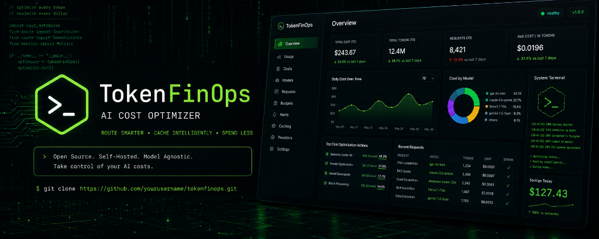

# TokenFinOps — Pluggable AI Cost Optimizer Gateway



TokenFinOps is a production-grade, open-ended, self-hostable AI Cost Optimization gateway that sits between client applications and LLM providers. It makes cost-aware routing, semantic caching, budget enforcement, and prompt optimization decisions in real time.

## Key Features

1. **Pluggable LLM Providers:** Bring-your-own-keys (BYOK). Support for OpenAI, Anthropic, Google Gemini, Ollama (local), vLLM (self-hosted), and OpenRouter.
2. **Pluggable Embeddings:** Support for local SentenceTransformers, OpenAI embeddings, Cohere, and Ollama.
3. **Core Optimization Engine:**
   - **Model Router:** Dynamically routes requests based on task type (coding, reasoning, translation, classification) and strategy (lowest cost vs. quality).
   - **Cost Predictor:** Estimates prompt tokens and cost prior to calling LLM providers.
   - **Semantic Cache:** Two-tier caching (L1 exact match in Redis, L2 vector semantic match in FAISS).
   - **Rate Limiter:** sliding window RPM rate limiter.
   - **Budget Manager:** Hard spending caps + soft thresholds with fallback model downgrades.
   - **Prompt Optimizer & Context Trimmer:** Saves inputs token fees by stripping filler words and compressing long histories.
   - **Smart Retry failover:** Automatically failover to fallbacks if primary API fails.
4. **Rich Dashboard & Observability:**
   - Dark-theme glassmorphic Web UI displaying daily costs, KPI overviews, model allocations, and transaction logs.
   - Prometheus metrics exporter (`/metrics`) and OpenTelemetry traces.

---

## Getting Started

### 1. Installation
Clone the repository and install dependencies using Python 3.12+ (we recommend using [uv](https://github.com/astral-sh/uv) for fast package resolution):
```bash
make install-all
```

### 2. Backing Services
Start PostgreSQL 16 and Redis 7 local containers:
```bash
make db-up
```

### 3. Setup Wizard
Run the onboarding wizard to configure your `.env` and `config.yaml` files:
```bash
make setup
```

### 4. Running the App
Start the FastAPI gateway:
```bash
make dev
```
Open your browser at `http://localhost:8000/` to view the optimization dashboard.

---

## API References

### Chat Completions (OpenAI-Compatible)
`POST /v1/chat/completions`
```json
{
  "model": "gpt-4o",
  "messages": [
    {"role": "user", "content": "How do I write a fast sorting algorithm in python?"}
  ],
  "budget_id": "team-engineering",
  "routing_preference": "balanced"
}
```

### Cost Estimation
`POST /v1/chat/completions/estimate`
Estimates prompt tokens, matching provider, and cost without execution.

---

## Adding Custom Plugins
To add a new LLM provider, create a new file under `src/tokenfinops/providers/` subclassing `LLMProvider` and implement the abstract methods. Auto-discovery will automatically register it upon startup if credentials are set.
